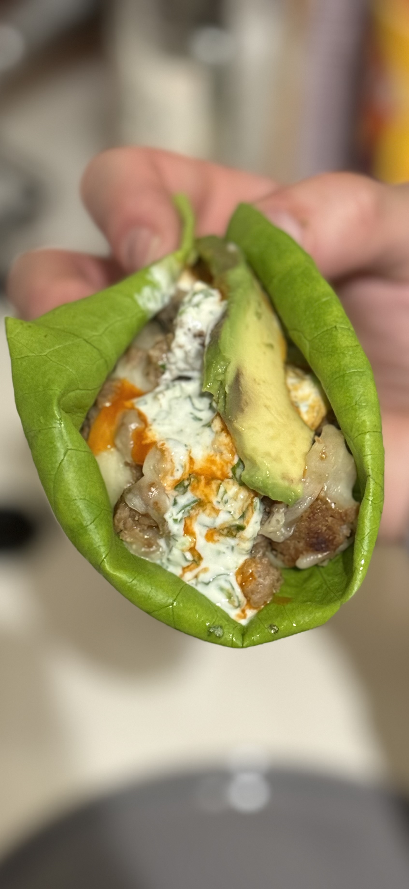
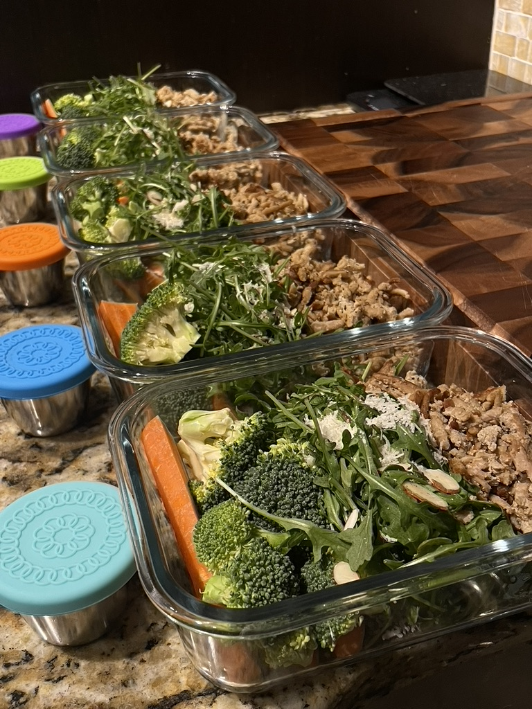
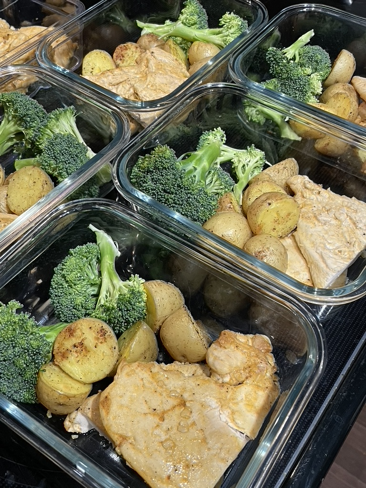
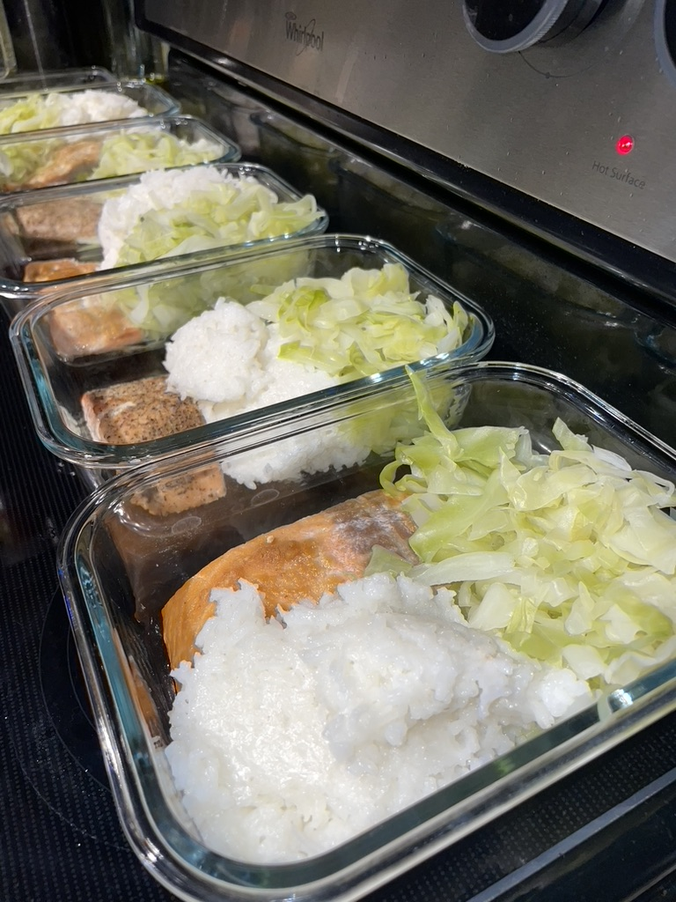
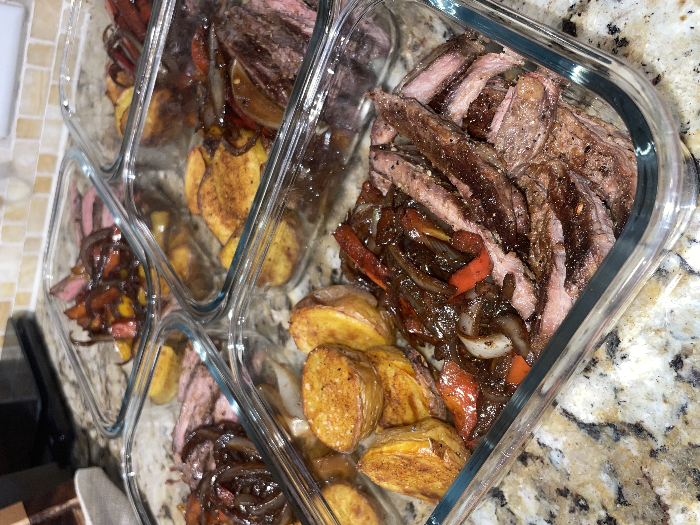
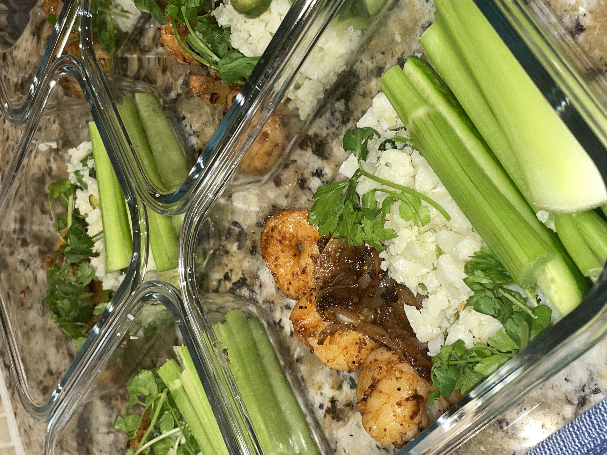
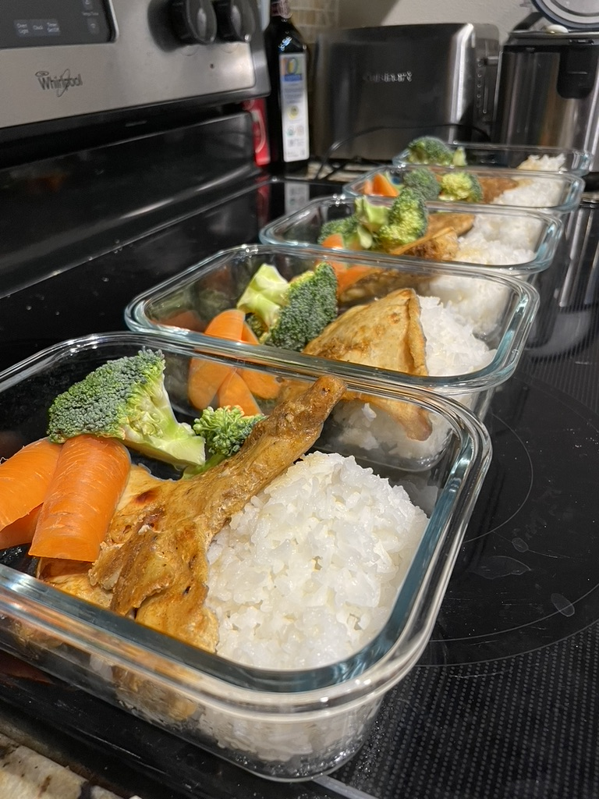
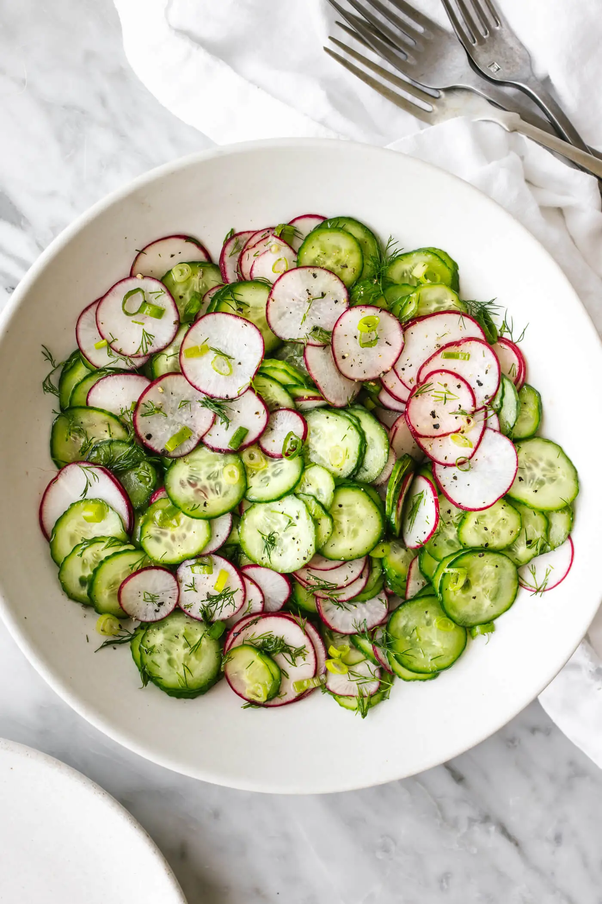

# What's for dinner?

<!-- Placeholder where the card will be injected -->

* TOC
{:toc}

---

## Main Entrees

### Turkey lettuce wraps with cilantro lime yogurt sauce

#### Turkey

- avocado oil
- seasonings
- Cheese

#### Sauce

- Greek yogurt plain
- 1/2 large lime juice with full lime zest
- Cilantro
- 3 Garlic cloves
- Salt/pepper

#### Toppings

- Avocado
- cholula hot sauce

---

### Ground turkey and arugula salad

- Ground turkey
- Arugula salad (olive oil, lemon, balsamic, salt/pepper, parmesan, almond shavings)
- Raw broccoli + carrots

---

### Chicken, broccoli, & potatoes

- Raw broccoli
- baked chicken breast
- potatoes

---

### Salmon filet w/side cabbage stir fry

- Salmon
- brown rice
- Steamed cabbage

---

### Steak and potatoes w/onions and bell peppers

- Skirt Steak
- deglaze pan with onions and bell peppers
- potatoes

---

### Cajun shrimp with cauliflower rice and cucumber

- cajun butter shrimp
- cauliflower rice
- celery + cucumber

---

### Cajun chicken with broccoli, carrots, rice or quinoa

- Baked chicken breast
- Organic raw broccoli and carrot
- Brown rice or white rice

---

### Quinoa turkey bowls

#### Stir fry

- Garlic
- Bell pepper
- Onion
- Green onion
- Olive oil

#### Sear

- Ground turkey
- Steam
- Quinoa

#### Top with

- Lime slice
- Cilantro
- Avocado
- Salsa

---

### Asian tuna salad

- https://www.instagram.com/reel/DDIYr2WzSD2/?igsh=N2RmYjBzenN4M2Rh

---

### Shrimp sushi bowls

- https://www.instagram.com/reel/DFBn7fxSOMi/?igsh=Z3lhcHhtdzg0eWd1

---

### Chicken caesar salad

- todo

---

### Lettuce burgers and sweet potato fries airfryed

- todo

---

## Side Dishes

### Sweet and tangy Korean cabbage salad

- [Korean cabbage salad](https://mykoreankitchen.com/sweet-and-tangy-cabbage-salad/)

---

### Cabbage stir fry

- recipe 1:
  - 1/2 napa cabbage
  - olive oil
  - garlic
  - oyster sauce
  - asian chicken powder/lee kum kee 1/4 tea spoon
  - 1 teaspoon sugar
  - salt
  - when cabbage is translucent, quarter table spoon of oyster sauce, add to taste
- recipe 2:
  - mix in a bowl
    - 2 tbsp oyster sauce
    - 2 tbsp warm water
  - then sauté as much garlic as desired,
  - full teaspoon of sugar
- recipe 3: panda express teriyaki sauce

---

### Bell peppers and onions

- todo

---

### Onions and mushrooms

- todo

---

### Cucumber and onion pico

- English cucumber small
- Red onion
- Radish
- Mint
- Sage
- Coriander
- Lime
- Salt

---

### Cucumber radish salad

- [Cucumber Radish Salad link](https://downshiftology.com/recipes/cucumber-radish-salad/)

---

### Orange sesame salad

- https://www.instagram.com/reel/DFTl1XwSB20/?igsh=MXdnOGhsaG00cW81dw==

---

### Sourdough mozzarella bruschetta

- olive oil
- basil
- tomato
- salt
- pepper
- mozzarella

---

### Zucchini Salsa

- Jalapeño
- Tomatillo
- Cilantro
- Zucchini
- Garlic
- Onion
- Olive oil
- Salt
- Water

### Salad with mustard dressing lime

- Lime
- Mustard
- Salt pepper
- Olive oil
- Crushed pepper

---

## Appendix

### Cajun butter shrimp (15 shrimp)

- Thawed shrimp
- Heat pan to medium heat and throw in3 tbsp of butter and 1.5 tbsp of minced garlic
- Lightly season shrimp with cajun seasoning
- Throw in shrimp with a qtr cup of water
- Generously season contents in pan
- Cook 5 min each side and add lemon juice right before flipping

---

### Sushi rice

- 2 cup rice and water each
- 1 tbsp salt
- 1/4 cup sugar, rice vinegar, and white wine vinegar each
- Rinse rice
- Bring rice and water to a boil, then turn to medium heat and cover for 10min
- Then turn to low for another 10 min
- Remove from heat and stand untouched for 15 min
- Mix vinegars with sugar and salt until they dissolve
- Mix all into a big bowl

---

### Smoothies

#### 1. Classic Green Smoothie

- Ingredients:
- 1 cup spinach
- 1 banana
- 1/2 cup Greek yogurt
- 1/2 cup almond milk
- 1 tablespoon honey
- Ice cubes

---

#### 2. Tropical Paradise Smoothie

- Ingredients:
- 1 cup kale
- 1/2 cup pineapple chunks
- 1/2 cup mango chunks
- 1/2 cup coconut milk
- 1 tablespoon chia seeds

---

#### 3. Berry Blast Smoothie

- Ingredients:
- 1 cup mixed berries (strawberries, blueberries, raspberries)
- 1/2 cup spinach
- 1/2 cup plain yogurt
- 1/2 cup water
- 1 tablespoon honey

---

#### 4. Avocado Mint Smoothie

- Ingredients:
- 1 ripe avocado
- 1/2 cup fresh mint leaves
- 1/2 cup spinach
- 1 cup coconut water
- 1 tablespoon lime juice

---

#### 6. Peanut Butter Banana Smoothie

- Ingredients:
- 2 ripe bananas
- 2 tablespoons peanut butter
- 1 cup almond milk
- 1 tablespoon honey
- Ice cubes

---

#### 7. Chocolate Banana Protein Smoothie

- Ingredients:
- 2 ripe bananas
- 2 tablespoons cocoa powder
- 1 scoop chocolate protein powder
- 1 cup milk of your choice
- Ice cubes

---

#### 8. Mango Lassi Smoothie

- Ingredients:
- 1 cup ripe mango chunks
- 1/2 cup plain yogurt
- 1/2 cup water
- 1 tablespoon honey
- A pinch of cardamom

---

#### 9. Blueberry Almond Delight

- Ingredients:
- 1 cup blueberries
- 1/4 cup almonds
- 1/2 cup Greek yogurt
- 1/2 cup almond milk
- 1 tablespoon honey

---

1#### 0. Spinach and Pineapple Green Smoothie

- Ingredients:
- 1 cup spinach
- 1 cup pineapple chunks
- 1/2 cup coconut water
- 1/2 cup Greek yogurt
- 1 tablespoon chia seeds

---

### Chicken Gyro Wraps

#### Tzatziki Sauce

- cup Greek Yogurt
- Salt
- Pepper
- 3 garlic cloves
- tablespoon of olive oil
- Juice of 1 lemon
- cucumber grated AND strained
- chopped dill

#### Chicken Marinade

- cup Greek Yogurt
- Salt
- Pepper
- 3 garlic cloves
- tablespoon of red wine vinegar
- tablespoon of olive oil
- teaspoon of ground coriander
- tablespoon of oreagano
- teaspoon of smoked paprika
- Juice of 1 lemon

#### Vegetable Meadly

- 1 cucumber
- 2 roma tomato
- 1/2 red onion
- 1 tablespoon red wine vinegar
- 1/4 cup parsley
- salt
- pepper

---

### Turkish pasta

- ground beef
- Pasta
- Paprika
- Curry powder
- Onion powder
- Salt/pepper
- Yellow onion
- Cherry Tomato
- Parsley

#### Sauce

- Greek yogurt
- Garlic
- Sauce

#### Butter sauce

- melted butter
- Dried mint
- Olive oil
- Chili flakes
- Paprika

#### Side

Broccolini and carrots

<a target="_blank" href="https://icons8.com/icon/123629/meal">Dinner</a> icon by <a target="_blank" href="https://icons8.com">Icons8</a>
